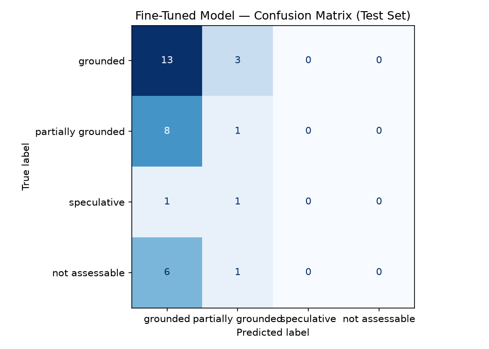
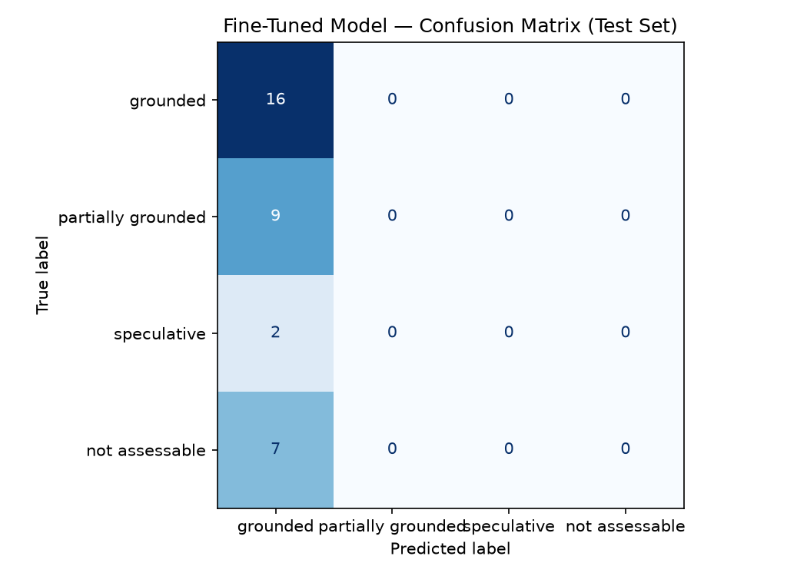

# TakeMeter

TakeMeter classifies the evidence grounding of comments from Reddit's r/AmItheAsshole (AITA). It assesses whether a comment's reasoning is supported by the original post and, for replies, the relevant parent-comment context.

[Demo video](https://drive.google.com/file/d/1aJ5JF-ko-yZYUwllFBXooePbXuEIRUEh/view?usp=sharing)

## Labels

| Label | Definition |
| --- | --- |
| Grounded | The main reasoning is supported by stated details, reasonable inferences, or relevant general knowledge without inventing case-specific facts. |
| Partially Grounded | The comment has an evidence-based core but also relies on unsupported assumptions, predictions, motives, or extrapolations. |
| Speculative | The central argument primarily depends on information not established by the post or conversation. |
| Not Assessable | The comment has too little substantive reasoning to evaluate, such as a bare verdict, joke, reaction, or agreement. |

### Grounded

A comment is **Grounded** when its main reasoning is supported by explicit details from the post or conversation, a reasonable inference from those details, or relevant general knowledge without inventing case-specific facts.

Examples:

- "Taking Zoey's makeup without permission and ruining it is not normal borrowing, so giving her a lock is a reasonable response."
- "She arranged for his car and parts to be removed while he was away, so seeking repayment for the loss is supported by what happened."

### Partially Grounded

A comment is **Partially Grounded** when it has a substantial evidence-based core but also includes one or more unsupported assumptions, predictions, motives, or extrapolations that materially contribute to the argument.

Examples:

- "The father is right to protect Zoey, and she will probably remember when she is older that he was the parent who supported her."
- "The girlfriend clearly ignored his property rights, and if they had eventually married she probably would have become even more controlling."

### Speculative

A comment is **Speculative** when its central argument depends primarily on information that the post or conversation does not establish, especially invented motives, hidden history, personality claims, causal explanations, or confident predictions.

Examples:

- "Sammy's attitude toward boundaries is probably the reason his marriage ended."
- "The scrapyard workers definitely knew the car was stolen and planned from the beginning to resell the parts."

### Not Assessable

A comment is **Not Assessable** when it does not contain enough substantive reasoning to evaluate evidence grounding, such as a bare verdict, joke, short reaction, or simple agreement.

Examples:

- "NTA."
- "Exactly!!"

### What the labels do not measure

Evidence grounding is **not** the same as whether I agree with the comment, whether the AITA verdict is correct, whether the comment is polite, or whether the comment is long. A comment can make a debatable moral judgment and still be Grounded if the reasoning is tied to the available evidence.

Relevant general knowledge also does not automatically make a comment speculative. The main concern is **unsupported case-specific claims**.

---


## Dataset

The annotated dataset contains 223 AITA comments from two discussion threads at depths 0 through 2. Each record includes the comment text, its depth, parent-comment identifier, evidence-grounding label, and optional annotation notes.

### Label Distribution

| Label | Comments | Share |
| --- | ---: | ---: |
| Grounded | 104 | 46.6% |
| Partially Grounded | 60 | 26.9% |
| Speculative | 14 | 6.3% |
| Not Assessable | 45 | 20.2% |
| **Total** | **223** | **100.0%** |

The stratified split used 156 comments for training, 33 for validation, and 34 for testing. Only 10 speculative comments were in training and two were in the test set. This imbalance makes the speculative metrics especially sensitive to individual examples.

### Difficult Labeling Decisions

These examples come from the annotated CSV. The decision is about the *reasoning in the whole comment*, not its verdict or tone.

| Comment excerpt | Boundary | Assigned label and reason |
| --- | --- | --- |
| “NTA. Borrowing requires permission. They are entering her private space and removing her personal items without permission. Which is the basics of breaking and entering…” | Grounded vs. Partially Grounded | **Partially Grounded.** Taking belongings without permission supports the privacy argument, but calling it “breaking and entering” asserts a specific legal characterization that the thread does not establish. The supported argument still stands without that addition. |
| “They’re probably jealous and acting out methinks” | Partially Grounded vs. Speculative | **Speculative.** This supplies a motive for the cousins without evidence about their feelings. Remove the jealousy claim and there is almost no argument left to evaluate. |
| “I hadn’t thought of that. Wow! I can totally see this now. And they are 18! Adults who should and probably do know better!” | Grounded vs. Not Assessable | **Not Assessable.** Mentioning their age makes this look case-specific, but the comment mainly agrees with someone else and adds a reaction. It does not explain a case-based conclusion in enough detail to assess its grounding. |
| “My husband has an old Datsun Ute … It’s his passion project … Your gf has shown you how little she cares about your passions and therefore you.” | Grounded vs. Partially Grounded | **Partially Grounded.** The personal example makes the advice understandable, but another person's car project cannot establish the girlfriend's motives in this case. The final claim extends past the available evidence. |

## Models and Training Setup

The fine-tuned base model is Hugging Face `distilbert-base-uncased` with a four-label classification head, trained with the Transformers `Trainer`. The saved notebook run used a local Jupyter kernel from this project's `.venv` (Python 3.12.3). Its output reports `GPU available: False`, so the recorded training was local without a CUDA GPU. The notebook also contains Colab T4 configuration metadata, which describes an available setup rather than the device reported by this run.

The notebook tokenizes comment text up to 256 tokens and uses a stratified train/validation/test split. The model input does not include the original post or parent-comment chain, even though those are part of the annotation criteria.

## Fine-Tuning Experiments

Both experiments used a learning rate of `2e-5`, a training batch size of 16, and a validation batch size of 32.

### Three-Epoch Run

The initial run trained for three epochs and completed 30 steps in 19 seconds.

| Epoch | Training loss | Validation loss | Validation accuracy |
| ---: | ---: | ---: | ---: |
| 1 | 1.346572 | 1.332544 | 0.454545 |
| 2 | 1.314574 | 1.298098 | 0.454545 |
| 3 | 1.265690 | 1.233501 | 0.454545 |

**[View the three-epoch confusion matrix](confusion_matrix_3.png)**

[](confusion_matrix_3.png)

### Hyperparameter Change: Eight Epochs

I changed `num_train_epochs` from `3` to `8` to test whether additional passes through the small training dataset would improve validation accuracy. The learning rate and batch sizes stayed the same. This run completed 80 steps in 53 seconds.

| Epoch | Training loss | Validation loss | Validation accuracy |
| ---: | ---: | ---: | ---: |
| 1 | 1.345716 | 1.326179 | 0.484848 |
| 2 | 1.320529 | 1.287007 | 0.454545 |
| 3 | 1.256526 | 1.219264 | 0.454545 |
| 4 | 1.188064 | 1.158407 | 0.454545 |
| 5 | 1.131199 | 1.105551 | 0.454545 |
| 6 | 1.055340 | 1.067094 | 0.454545 |
| 7 | 0.985700 | 1.040143 | 0.454545 |
| 8 | 0.920741 | 1.030952 | 0.484848 |

The saved [evaluation_results.json](evaluation_results.json) contains the evaluation metrics from this eight-epoch experiment.

**[View the eight-epoch confusion matrix](confusion_matrix.png)**

[](confusion_matrix.png)

The highest validation accuracy in the eight-epoch run was `0.484848` at epoch 1, tied again at epoch 8. This is only `0.030303` higher than the three-epoch run's `0.454545` peak. Validation loss fell throughout training, but validation accuracy remained almost flat, so increasing the epoch count did not produce a meaningful accuracy improvement.

## Evaluation Report

### Baseline Approach

The comparison baseline called Groq's `openai/gpt-oss-120b` once per test comment, using the system prompt below and a user message containing `Classify this comment:` followed by the comment text. The request used temperature `0`, low reasoning effort, and a 256-token completion limit. The notebook lowercased each reply and matched it to one of the four label names, then compared the predictions with the 34 held-out annotations using accuracy and a per-class classification report. All 34 replies in the saved run were parseable.

```text
You classify the evidence grounding of Reddit comments from r/AmItheAsshole (AITA).

Judge how well a comment's reasoning is supported by the information available in the original post and, for replies, the relevant parent-comment context. Do not judge whether the AITA verdict is correct, whether the comment is polite, or whether it is long.

Assign each comment exactly one category:

grounded: The main reasoning is supported by explicit details from the post or conversation, a reasonable inference from those details, or relevant general knowledge without inventing case-specific facts.
Example: "Taking Zoey's makeup without permission and ruining it is not normal borrowing, so giving her a lock is a reasonable response."

partially grounded: The comment has a substantial evidence-based core but also includes unsupported assumptions, predictions, motives, or extrapolations that materially contribute to the argument.
Example: "The father is right to protect Zoey, and she will probably remember when she is older that he was the parent who supported her."

speculative: The central argument depends primarily on information that the post or conversation does not establish, especially invented motives, hidden history, personality claims, causal explanations, or confident predictions.
Example: "Sammy's attitude toward boundaries is probably the reason his marriage ended."

not assessable: The comment does not contain enough substantive reasoning to evaluate evidence grounding, such as a bare verdict, joke, short reaction, or simple agreement.
Example: "NTA."

Respond with ONLY one exact lowercase label and nothing else: grounded, partially grounded, speculative, or not assessable.
```

The prompt asks for a judgment against post and reply context, but the baseline request supplies only the target comment. This limits what the baseline can verify about a case-specific claim.

### Overall Results

The saved eight-epoch evaluation used the same 34-example test set for both models. All 34 Groq baseline responses were parseable. The fine-tuned DistilBERT reached higher accuracy, but its macro F1 fell because it predicted only **grounded**.

| Model | Accuracy | Correct / total | Macro F1 | Weighted F1 |
| --- | ---: | ---: | ---: | ---: |
| Groq baseline | 0.265 | 9 / 34 | 0.20 | 0.17 |
| Fine-tuned DistilBERT, eight-epoch experiment | 0.471 | 16 / 34 | 0.16 | 0.30 |

These are the figures in the current notebook output and [evaluation_results.json](evaluation_results.json) (`0.2647` and `0.4706` before display rounding). An earlier README entry reported baseline accuracy of `0.324` from a previous run; the current saved evaluation reports `0.265`. The comparison below uses the current saved run consistently.

### Per-Class Metrics: Groq Baseline

| True label | Precision | Recall | F1 | Support |
| --- | ---: | ---: | ---: | ---: |
| grounded | 0.33 | 0.06 | 0.11 | 16 |
| partially grounded | 0.00 | 0.00 | 0.00 | 9 |
| speculative | 0.09 | 0.50 | 0.15 | 2 |
| not assessable | 0.37 | 1.00 | 0.54 | 7 |
| **Macro average** | **0.20** | **0.39** | **0.20** | **34** |
| **Weighted average** | **0.24** | **0.26** | **0.17** | **34** |

The earlier baseline run produced `0.324` accuracy on 34/34 parseable responses. Its recorded per-class results are retained here for comparison across runs; the notebook's current saved predictions and JSON correspond to the `0.265` results above.

| Earlier baseline label | Precision | Recall | F1 | Support |
| --- | ---: | ---: | ---: | ---: |
| grounded | 0.50 | 0.06 | 0.11 | 16 |
| partially grounded | 0.50 | 0.22 | 0.31 | 9 |
| speculative | 0.11 | 0.50 | 0.18 | 2 |
| not assessable | 0.37 | 1.00 | 0.54 | 7 |
| **Macro average** | **0.37** | **0.45** | **0.28** | **34** |
| **Weighted average** | **0.45** | **0.32** | **0.26** | **34** |

### Per-Class Metrics: Fine-Tuned DistilBERT

| True label | Precision | Recall | F1 | Support |
| --- | ---: | ---: | ---: | ---: |
| grounded | 0.47 | 1.00 | 0.64 | 16 |
| partially grounded | 0.00 | 0.00 | 0.00 | 9 |
| speculative | 0.00 | 0.00 | 0.00 | 2 |
| not assessable | 0.00 | 0.00 | 0.00 | 7 |
| **Macro average** | **0.12** | **0.25** | **0.16** | **34** |
| **Weighted average** | **0.22** | **0.47** | **0.30** | **34** |

### Fine-Tuned Confusion Matrix

Rows are true labels; columns are predicted labels. The matrix records the eight-epoch experiment's test predictions.

| True label ↓ / Predicted label → | grounded | partially grounded | speculative | not assessable |
| --- | ---: | ---: | ---: | ---: |
| grounded | **16** | 0 | 0 | 0 |
| partially grounded | 9 | **0** | 0 | 0 |
| speculative | 2 | 0 | **0** | 0 |
| not assessable | 7 | 0 | 0 | **0** |

All 18 errors went to **grounded**: nine partially grounded, seven not assessable, and two speculative comments. This is a directional collapse toward one label, rather than confusion between just one neighboring pair. The speculative class has only two test examples, so its individual metrics are especially unstable.

### AI-Assisted Failure Analysis and Manual Check

Before interpreting the errors, I used this AI assistant to group the notebook's misclassified examples and suggest possible themes: a default prediction of grounded, short comments, sarcasm, and unsupported additions to otherwise relevant comments. I then reread the saved predictions and their source CSV annotations. For a focused check of five errors, I reviewed three **not assessable** comments (the “Nta” reaction, the “best in show” response, and the “YTA. move out” quip) and two **partially grounded** comments (the vehicle-title claim and the Datsun anecdote). All five were predicted **grounded**, matching the full confusion matrix.

The **not assessable → grounded** boundary fails when a verdict, joke, or firm opinion appears without enough case-directed reasoning to evaluate. The **partially grounded → grounded** boundary fails when a relevant fact or analogy is followed by a stronger claim the case does not establish. These labels appear consistently applied in the five reviewed annotations; the larger concern is that the model does not separate substantive reasoning from reactions, or supported statements from unsupported extensions.

The AI suggestion that short length explained the errors did not survive review: the vehicle-title and Datsun comments are longer, and the matrix shows every missed class going to grounded. Humor or sarcasm describes some reaction comments but does not explain the legal claim or personal anecdote. Those features may occur in individual errors; they are not the overall failure pattern.

The reviewed wrong predictions had displayed top-label scores of `0.28`–`0.29`, only slightly above the four-class uniform value of `0.25`. These scores show weak separation among labels in these examples; they are not calibrated probabilities or proof of why the model chose grounded.

#### Three Specific Errors

1. **“Nta. Fuck her, that is ridiculous.”** True: **not assessable**; predicted: **grounded** (`0.28`). The comment gives a verdict and emotional reaction but no reason tied to the post. The model assigned its default label even though there is no grounding argument to assess. More labeled bare verdicts and reactions would help define this boundary.

2. **“&gt;she had lost the title for it … She effectively stole this vehicle from you and committed fraud along the way.”** True: **partially grounded**; predicted: **grounded** (`0.28`). The missing title and vehicle removal provide a relevant factual core. The legal conclusion depends on facts and jurisdiction not established by the thread. The model did not separate the supported premise from the unsupported conclusion. Training examples that pair supported facts with overextended legal claims would target this boundary.

3. **“My husband has an old Datsun Ute … It’s his passion project … Your gf has shown you how little she cares about your passions and therefore you.”** True: **partially grounded**; predicted: **grounded** (`0.29`). The anecdote makes the comment's concern understandable, but someone else's experience does not establish the girlfriend's motives or feelings in this case. More contrast examples involving relevant personal stories and unsupported case-specific conclusions would help.

The “best in show” and “YTA. move out” comments confirm the first boundary: each is a reaction or quip without a substantive case-based explanation, yet each was predicted grounded. The CSV annotation notes use the same **not assessable** rule for these comments.

### Sample Classifications

These examples come from the fine-tuned model's saved test predictions. Confidence is the predicted label's softmax score as printed by the notebook.

| Comment text | True label | Predicted label | Confidence | Correct? |
| --- | --- | --- | ---: | --- |
| “NTA. Good for you for standing up for your daughter. The lock should stay. There would be no need for it except that the girls are thieves.” | grounded | grounded | 0.29 | Yes |
| “Nta. Fuck her, that is ridiculous.” | not assessable | grounded | 0.28 | No |
| “&gt;she had lost the title for it … She effectively stole this vehicle from you and committed fraud along the way.” | partially grounded | grounded | 0.28 | No |
| “if you can’t see this comment as the best in show then get off the judges platform and sit with the civilians.” | not assessable | grounded | 0.28 | No |
| “My husband has an old Datsun Ute … Your gf has shown you how little she cares about your passions and therefore you.” | partially grounded | grounded | 0.29 | No |

The correct example names the daughter, the lock, and the cousins' taking of her belongings, so **grounded** is a reasonable label under the annotation guide. Because the model predicted grounded for *every* test comment, this correct row alone does not show that it learned to identify evidence-based reasoning.

### Reflection and Next Steps

The intended task was to judge how well a comment's reasoning follows from the original AITA post and its reply context. The model instead appears to have learned a majority-class shortcut: grounded was 104 of 223 annotated comments and 16 of 34 test comments, exactly matching its `0.471` test accuracy when it predicted grounded for every case. It missed the difference between an opinion and a reason, and between a relevant premise and an unsupported extrapolation.

The notebook currently tokenizes only `comment_text`; it does not supply the original post text or parent-comment chain described in the annotation plan. That limits its ability to decide whether a claim is supported by the case. The next experiment should include the relevant context, add more diverse **not assessable**, **partially grounded**, and **speculative** examples, and evaluate with macro F1 and per-class recall rather than accuracy alone. Review annotation consistency for close boundaries before adding data. With only two source threads and two speculative test examples, these results remain preliminary.

## Spec Reflection

**One way [planning.md](planning.md) helped during implementation:** The plan defined all four labels and the difficult boundaries before the notebook was adapted. I used its rule for distinguishing an evidence-based core from an unsupported extension when writing the classification prompt and checking cases such as the vehicle-title comment. Its separate **Not Assessable** rule also helped explain why a bare verdict or reaction should not be treated as grounded reasoning.

**One divergence from the spec, and why:** The plan says a comment should be judged using the original post and, for replies, the parent-comment chain. The implemented notebook trains and evaluates on `comment_text` alone because the starter model pipeline accepts a single text field and the annotated CSV does not contain the full original post body or an assembled reply chain. This makes the current experiment a limited test of comment-only cues; a later version needs to construct the promised context before training and evaluation.

## AI Usage

**Instance 1 — adapting the dataset loader**

- *What I gave the AI:* The starter notebook's `text`/`label` loading cell and the headers of `takemeter_depth_0_1_2_annotated_with_notes.csv`.
- *What it produced:* A loader that renames `comment_text` to `text` and `grounding_label` to `label`, normalizes the four label strings, and converts them to numeric IDs.
- *What I changed or directed:* I specified that the upload must use the annotated-with-notes CSV, rather than whichever file was selected first. I also checked the CSV's actual label spellings so the map uses `partially grounded` and `not assessable`, matching the data and downstream parser.

**Instance 2 — writing the baseline prompt**

- *What I gave the AI:* The prompt skeleton in the notebook and the four label definitions and examples in [planning.md](planning.md).
- *What it produced:* An AITA evidence-grounding prompt with a definition and example for each label, plus an instruction to return a single label.
- *What I changed or directed:* I required the output labels to match the notebook's exact lowercase label strings and included all four project labels in place of the starter's three placeholders. I checked the final prompt against the planning definitions before using it for the Groq baseline.

**Instance 3 — reviewing wrong predictions**

- *What I gave the AI:* The fine-tuned model's misclassified examples, their true and predicted labels, confidence scores, and the confusion matrix.
- *What it produced:* Candidate patterns: overprediction of **grounded**, possible effects of short comments and sarcasm, and missed unsupported claims in longer comments.
- *What I changed or overrode:* I reread the examples and annotation notes, then kept the **grounded** collapse as the supported pattern. I rejected short length and sarcasm as general explanations because the model also mislabeled longer legal-claim and personal-anecdote comments. The verified pattern, corrections, and specific cases are reported in the failure analysis above.
